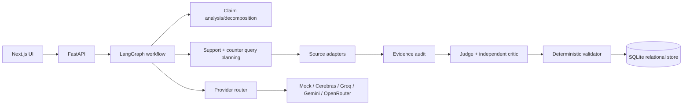

# VeriClaim AI

VeriClaim AI is an evidence-driven claim verification MVP for AI, machine learning, software engineering, and scientific-computing claims. It is deliberately not a generic fact-check chatbot: agents have bounded responsibilities, retrieval is source-adapter based, and a verdict is valid only when it can be traced to stored evidence and provenance.

## What is implemented

- FastAPI API with SQLite persistence and stable verification run IDs.
- LangGraph workflow: analyze → decompose → plan → support/counter research → audit → judge → critic → deterministic validation.
- Strong-quantifier detection, compound-claim decomposition, Thai layout-only normalization, and structured Pydantic v2 models.
- Offline deterministic fixture provider/source for reproducible development and tests.
- Six provider adapters: Cerebras, Groq, Gemini, OpenRouter, OKMD, and ThaiLLM. Providers require both an explicit `*_ENABLED=true` flag and a key; missing or disabled providers degrade safely to the bounded fallback path.
- Provider responses normalize configured/actual model IDs, finish reason, latency, usage, quota metadata, and categorized failures. Cerebras remains representable as configured-but-disabled, and OpenRouter is restricted to free routes.
- OpenAlex and Crossref normalized source adapters with explicit HTTP timeouts and metadata-versus-abstract evidence levels. arXiv is an interface placeholder until its response parsing contract is added.
- Minimal Next.js UI with Overview-style result, evidence, sources, conditions, limitations, and run metadata.
- Server-side request bounds for claim size, atomic claims, retrieval queries, evidence candidates, and provider calls.
- A bounded SciFact evaluation path with a local, hash-validated manifest,
  deterministic closed-corpus BM25 retrieval, offline fixture execution, and
  persisted run artifacts.

Supported verdicts are `SUPPORTED`, `REFUTED`, `MIXED`, `INSUFFICIENT_EVIDENCE`, and `NON_VERIFIABLE`. Confidence means confidence in the verdict given the evidence retrieved by this run, not the probability that the claim is objectively true. Production confidence is currently a deterministic evidence-rule heuristic (including the explicit `MIXED` heuristic value 0.65); it is not calibrated probability.

Current evidence boundaries:

- **IMPLEMENTED / REPRODUCIBLE:** deterministic/offline fixture mode; bounded
  SciFact evaluation; manifest and hash verification; offline architecture
  comparison; provider-isolation tooling; evidence provenance; deterministic
  verdict validation; and persisted run/evidence trace.
- **PARTIAL / LIMITED:** small bounded benchmark profiles; live-provider
  availability and quota constraints; incomplete paired live-isolation results;
  uncalibrated heuristic confidence where applicable; and source-adapter
  limitations.
- **NOT ESTABLISHED:** universal factual correctness; a production SLA;
  benchmark superiority from incomplete live runs; calibrated probability of
  truth; unrestricted web fact checking; autonomous browsing; or
  production-grade multi-tenant security.

## Architecture



Domain logic depends on normalized source/provider interfaces, so PostgreSQL or additional adapters can be introduced without changing verdict logic. The MVP intentionally has no Redis, queue, vector database, graph database, or autonomous browsing.

See [docs/architecture.md](docs/architecture.md) for responsibilities and persistence boundaries.

## Setup

Python 3.12+ and Node.js 18+ are required.

```powershell
uv venv
uv pip install -e ".[dev]"
Copy-Item .env.example .env
uvicorn vericlaim.api:app --reload
```

In another terminal:

```powershell
Set-Location apps/web
npm install
npm run dev
```

Open `http://localhost:3000`. The API is at `http://localhost:8000`.

## Evaluation

The repository includes a reproducible, bounded SciFact evaluation path under `evals/scifact`. The checked-in `evals/fixtures/scifact/` snapshot is a small deterministic fixture with a hash-validated manifest for offline CI; `scripts/prepare_scifact.py` can prepare the official AllenAI snapshot under ignored `evals/data/scifact/` for an explicitly reviewed run. The protocol uses deterministic closed-corpus BM25 retrieval and four primary architectures: `A_SINGLE_LLM`, `B_RETRIEVAL_JUDGE`, `C_SUPPORT_COUNTER`, and `D_FULL_VERICLAIM`. A follow-up isolation family (`D1_AUDITOR`, `D2_CRITIC`, `D3_AUDITOR_CRITIC`, and `D4_CONDITIONAL_CRITIC`) separates assurance mechanisms without adding them to the default critical path. Live evaluation uses fixed Groq `openai/gpt-oss-20b` and Gemini `gemini-flash-lite-latest` configurations when explicitly requested; the isolation runner can use one explicitly selected available provider for all stages; OpenRouter is excluded. No incomplete live run is promoted as a benchmark conclusion.

Prepare and validate the pinned local snapshot:

```powershell
python scripts/prepare_scifact.py --root evals/data/scifact --download
python scripts/eval_scifact.py --architecture all --profile smoke --dry-run
python scripts/eval_scifact.py --architecture all --profile smoke --offline
python scripts/eval_scifact.py --architecture isolation --profile smoke --offline
```

Use `--offline` for deterministic provider fixtures. For live free-tier runs, inspect the dry-run call estimate first, then run the same bounded profile with the authorized fixed providers. Results are written under `evals/results/<benchmark_run_id>/` with manifest, metrics, predictions, cache/usage, and error-analysis artifacts. Telemetry distinguishes logical stage invocations, actual provider calls, cache hits, current-run tokens, and provider latency. The default profile is a 10-example smoke; the 50-example pilot is quota-gated. `API_COST_USD=N/A` is intentional because no paid cost is inferred.

The isolated live-5 runner is separately hard-gated at 100 provider calls with a derived unknown-quota token ceiling. Review `python scripts/eval_agent_isolation.py --profile live-5 --dry-run` before invoking it. All stages must use one explicitly selected fixed provider/model; OKMD can be selected explicitly as `deepseek-v4-flash`, and its preflight requires two identical probes with matching configured/actual model and known quota metadata. The preflight reports cache hits/misses, reserves possible critic/recheck branches, and requires at least 10% call/token headroom. Provider rate limits, quota errors, incomplete responses, model substitutions, or incomplete pairs stop the run and are reported as `BLOCKED`; no provider fallback or automatic live-10 run is performed.

For unstable free providers, use the resumable windowed live-5 runner. Calibrate a transport-only reliability envelope on non-target claims, then run one fixed-provider/model benchmark in bounded windows:

```powershell
python scripts/eval_agent_isolation_resumable.py --provider okmd --calibrate-only --reliability-profile evals/results/scifact-reliability-live-5-okmd.json
python scripts/eval_agent_isolation_resumable.py --provider okmd --reliability-profile evals/results/scifact-reliability-live-5-okmd.json --window-max-calls 8
python scripts/eval_agent_isolation_resumable.py --provider okmd --resume --checkpoint evals/results/scifact-live-5-resumable-<run>/checkpoint.json --reliability-profile evals/results/scifact-reliability-live-5-okmd.json --window-max-calls 8
```

The checkpoint persists successful predictions, exact structured stage-cache provenance, authoritative provider-attempt telemetry, locked actual model, and per-window hashes/counters. Resume replays cache hits and calls only the first uncached stage; it never changes provider/model or falls back. Three consecutive low-progress failure windows produce `PROVIDER_UNSUITABLE_FOR_BENCHMARK`. Quality comparison is valid only after `25/25` paired predictions with zero model drift/substitution.

See [docs/evaluation.md](docs/evaluation.md) for dataset versioning, label mapping, evidence/abstention/calibration metrics, ablation interpretation, and limitations. Small smoke runs report `CALIBRATION_SAMPLE_TOO_SMALL` rather than calling heuristic confidence calibrated.

## Providers and free-tier routing

Copy `.env.example` to `.env`. `MOCK_PROVIDER_ENABLED=true` is the safe default. Only add provider keys you are authorized to use; `.env` remains ignored and local-only.
Provider keys are loaded as redacted `SecretStr` values and are unwrapped only at
the outbound provider boundary. Do not log `Settings`, serialize raw settings,
or place replacement credentials in Git. Rotate and revoke any key exposed during
development before using a preview or production environment.

The default specialization is deterministic rules first, Groq for claim/decomposition/classification assistance, Gemini for audit/judgment, OKMD for critique, ThaiLLM for Thai semantic review, and OpenRouter only as a last-resort free runtime fallback. `openrouter/free` is non-deterministic and is excluded from reproducible routing unless explicitly allowed. Cerebras is disabled by default because free inference must be re-probed before enabling.

OKMD quota metadata is recorded when the API returns `model_quota.daily_quota_tokens`, `daily_usage_tokens`, and `daily_remaining_tokens`. An embedded daily-budget error is classified as quota exhaustion and falls back without retrying the same provider. ThaiLLM uses HTTPS only and strips a complete leading `<think>...</think>` block with at most one bounded retry for an incomplete response. A word containing `think` without those tags is preserved.

Recommended non-secret models are documented in `.env.example`; enable flags remain false there.

Historical local smoke snapshot (2026-08-25): Gemini, Groq, OpenRouter free, and ThaiLLM returned usable content; Cerebras model access was visible but inference remained disabled; OKMD returned an API-level permission failure in that snapshot. Re-run the explicit provider preflight before treating any provider as healthy.

## API

```text
GET  /health
GET  /ready
POST /api/v1/claims/verify       {"claim":"RAG eliminates hallucinations."}
GET  /api/v1/runs/{run_id}
GET  /api/v1/runs/{run_id}/evidence
GET  /api/v1/runs/{run_id}/evidence-graph
GET  /api/v1/providers/status
```

`/health` is a liveness probe and does not call a provider. `/ready` checks the database connection and requires at least one explicitly enabled provider (the deterministic mock counts for local/demo deployments); it returns HTTP 503 with sanitized check names when the service is not ready. Set `CORS_ALLOWED_ORIGINS` to a comma-separated allowlist when deploying the web client.

The verification endpoint completes synchronously for the MVP. Offline mode uses the deterministic fixture source. The explicit live E2E boundary sets `LIVE_RETRIEVAL_ENABLED=true` and uses OpenAlex/Crossref; metadata-only records are persisted as sources but cannot become evidence. Each run stores claims, atomic claims, queries, sources, evidence, assessments, verdict details, agent runs, provider usage, and fallback breadcrumbs. Every final evidence reference is validated against the same run's stored evidence.

The result `issue_code` is an operational signal separate from the verdict. It can report `PROVIDER_UNAVAILABLE`, `QUOTA_EXHAUSTED`, `PROVIDER_RATE_LIMIT`, `PROVIDER_TIMEOUT`, `PROVIDER_AUTHENTICATION`, `PROVIDER_RESPONSE_INVALID`, `RETRIEVAL_UNAVAILABLE`, or `REQUEST_LIMIT_EXCEEDED`. A degraded result remains inspectable, but the UI explicitly tells the user to inspect the run trace before relying on provider-assisted output. `INSUFFICIENT_EVIDENCE` remains a verdict label, not a provider failure.

The API enforces conservative per-request bounds: a 2,000-character claim, at most 8 atomic claims, 16 retrieval queries, 32 evidence candidates, and 8 provider-call attempts. Verification has a 30-second cooperative request deadline and returns a sanitized `504 REQUEST_TIMEOUT` when exceeded. Provider and retrieval adapters also use explicit timeouts, retries are bounded to one same-provider retry, excerpts are capped, and the MVP does not fetch user-supplied URLs.

The evidence graph is a read-only projection of the stored run: claim → atomic claim → evidence → source. It performs no new retrieval or provider call, exposes source provenance and evidence level, and keeps evidence excerpts inspectable in the UI. This makes the local fixture demo useful even when external providers are unavailable.

## Testing and CI

```powershell
pytest
ruff check .
ruff format --check .
mypy src
git diff --check
Set-Location apps/web
npm install
npm run lint
npm run typecheck
npm run build
```

Normal tests make no external LLM or retrieval calls, even when a developer's ignored `.env` contains enabled providers. Real-provider tests require `RUN_LIVE_PROVIDER_TESTS=true` and are never required in CI. Run a minimal provider pass with `python scripts/smoke_providers.py --provider all`; it prints only provider/model/status/usage metadata. Run one live persisted verification with `python scripts/smoke_verification.py --preset english` or `--preset thai`; it prints counts, safe source domains/DOIs, provider/model usage, and fallback breadcrumbs, never response bodies or credentials. For deployment smoke checks, start the API and request both `/health` and `/ready`; neither endpoint performs inference. The checked-in SciFact fixture and hash-validated manifest support reproducible offline evaluation. Official dataset preparation and live-provider evaluation are explicit opt-ins, and live results are not comparable or promotable unless the fixed-provider, complete-pair requirements in [docs/evaluation.md](docs/evaluation.md) are satisfied.

## Limitations and roadmap

The checked-in fixture and small smoke/pilot profiles are bounded evaluation evidence, not universal benchmark claims. The offline reference summary records the deterministic configuration only; its small population reports `CALIBRATION_SAMPLE_TOO_SMALL`, and it does not establish live paired architecture superiority, production promotion, or calibrated confidence. Live paired isolation remains constrained by provider availability and quota; incomplete runs are diagnostic/`BLOCKED`, not superiority evidence. The workflow uses deterministic local domain logic to guarantee reproducibility; provider outputs are bounded structured candidates/advisories and cannot invent evidence or override deterministic validation. Retrieval adapters are bounded and not a general web browser. Next steps are richer evidence extraction, cache instrumentation, complete arXiv parsing, async job state if real retrieval latency requires it, browser-level UI verification, and expanded benchmark profiles.
