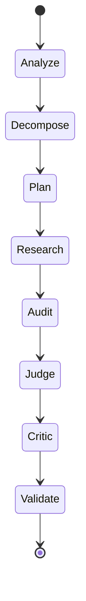

# VeriClaim AI architecture

## Bounded verification graph

Each node has one responsibility. Support and counter research share a bounded retrieval surface but are represented by distinct query directions and evidence IDs. Researchers never produce the final verdict. The critic receives the proposed judgment and checks citation coverage, scope mismatch, temporal mismatch, and strong wording.

For the provisional evaluation core, retrieval plus support/counter classification plus judge plus deterministic validation is the default path. Auditor and critic are targeted assurance mechanisms: the auditor returns structured evidence-quality assessments, while the critic can challenge a proposed judgment and trigger at most one bounded recheck. They are not second judges and are not mandatory for every request until isolated benchmark evidence supports that cost.

The SciFact isolation benchmark is a separate controlled path: one explicitly selected fixed provider and model are used for every stage, model/provider substitution is rejected, and incomplete or failed paired predictions are invalid for comparison. A provider recovery probe may establish eligibility, but it does not authorize dynamic fallback or a production default change.

## Domain and persistence

The domain models are Pydantic v2 objects. SQLAlchemy rows store JSON snapshots plus run keys in these tables:

`verification_runs`, `claims`, `atomic_claims`, `search_queries`, `sources`, `evidence`, `evidence_assessments`, `verdicts`, `agent_runs`, and `provider_usage`.

The JSON snapshot makes a run inspectable and reproducible while the separate tables leave room for PostgreSQL indexes and relational queries later. Domain logic does not import SQLAlchemy.

The read-only evidence graph projection is built from that stored snapshot. It links the stored claim to deterministic atomic claims, then to same-run evidence and its source provenance. Graph reads do not retrieve new records or invoke an LLM, so source inspection remains safe when a provider is degraded or unavailable.

## Provider boundary

`LLMProvider` returns normalized provider/configured-model/actual-model/text/token/latency/finish-reason/quota data. `ProviderRouter` selects a task-specific preferred provider and bounded fallbacks. A provider requires both an explicit enabled flag and a key; a configured-but-disabled provider remains visible in status without becoming callable. HTTP 401/403/402/429/5xx, timeout, malformed, and incomplete responses become categorized failures. At most one cheap same-provider retry is allowed before fallback, and vendor payloads/raw keys are never returned by the API.

The mock provider is the default reproducibility boundary. OpenAI-compatible adapters use documented REST shapes for Cerebras, Groq, OpenRouter, and OKMD. Gemini uses its `generateContent` REST shape. ThaiLLM uses the HTTPS OpenAI-compatible endpoint and receives a conservative reasoning-block normalization. OpenRouter is restricted to free routes and excluded from reproducible calls by default.

The workflow calls deterministic rules first, then uses bounded provider calls for batched classification, audit, judgment, critique, and Thai semantic review when configured. Provider text is parsed as a candidate only; Pydantic/domain constraints and `validate_result` remain authoritative. Normal tests force live flags off. Live smoke tests are explicit and never print response bodies.

The API separates `/health` (liveness) from `/ready` (database plus enabled-provider readiness). Provider failures are surfaced as a safe `issue_code` on a degraded result, while `INSUFFICIENT_EVIDENCE` remains a domain verdict. Neither readiness nor provider-status endpoints reveal credentials or raw vendor payloads. Request handling enforces bounded claim size, atomic claims, retrieval queries, evidence candidates, and provider-call attempts; adapter timeouts, one same-provider retry, and bounded excerpts prevent unbounded work. The MVP has no user-supplied URL fetch, so SSRF is not an inference path.

## Evidence boundary

Source adapters normalize external records into `RetrievedRecord`, then the workflow stores `Source` and `Evidence` records. Records are explicitly classified as metadata-only or abstract/full-text evidence; metadata-only records can be persisted for traceability but cannot be used as textual evidence. Assessments retain separate dimensions (relevance, directness, source quality, recency, temporal/scope compatibility, reproducibility signal, stance, and extraction confidence). No opaque credibility score replaces those dimensions.

Fixture sources use `fixture://` provenance and are visibly labeled as bundled deterministic fixtures. They are useful for local flow tests, not evidence of real-world truth. `LIVE_RETRIEVAL_ENABLED=true` is an explicit opt-in for OpenAlex/Crossref retrieval and is exercised by `scripts/smoke_verification.py`, which persists and reloads one result without printing raw excerpts or secrets.
